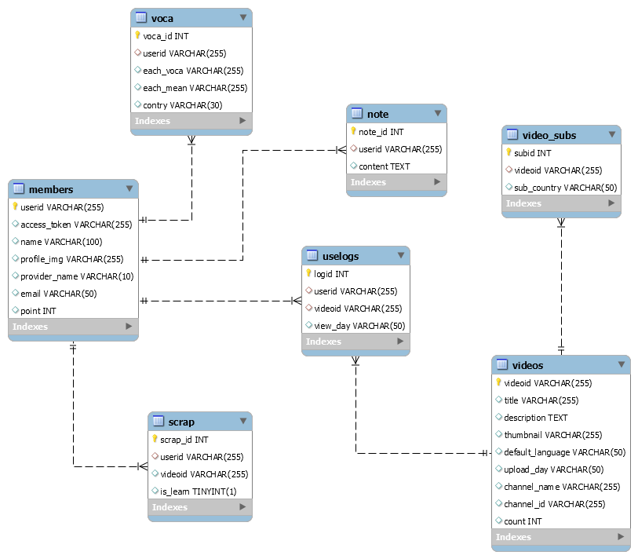

# <span style="color:#6B66FF">More</span><span style="color:#FFE400">Lang</span>

## 프로젝트 소개

### 주제 :  'YouTube' 영상을 활용한 외국어 학습 컨텐츠
> 쟤 머랭?❓ 나도 몰랑 😓 그럼 다같이 **"More lang!"** ✔    
> 여러분의 더 많은 language를 위해 **More Lang** 하세요!  
> 즐겨보는 유튜브 영상을 통해 **언제(When)**, **어디서든(Where)**, **쉽게(Easy)** 외국어 학습을 하자!  
> 영어 퀴즈 및 발음 측정 등 다양한 컨텐츠를 통한 재밌는 언어학습 서비스 **🎉MoreLang** 입니다.

---
### ✔ 주요기능(구현 예정)

<details>
<summary>1. 로그인 / 로그아웃 ✔</summary>

  - *Google Api를 활용한 구글 로그인 구현예정 ( 관심 영상을 파악하기 위해)*
</details>
<details>
<summary>2. 단어 배열</summary>

  - *주요 문장의 영어 단어 배열 퀴즈를 통한 학습력 향상*
</details>
<details>
<summary>3. 발음 교정</summary>

  - *발음 녹음 뒤 해당 발음이 얼마나 표준 발음과 유사한지 점수제공*
</details>
<details>
<summary>4. 번역</summary>

  - *영상 영어 자막 및 한글 번역 제공*
</details>     
<details>
<summary>5. 단어장</summary>

  - *자막 단어 Hover 시 사전 모달 우측상단에 단어장 스크랩 버튼을 통한 간단한 단어장 만들기 기능*
</details>
<details>
<summary>6. 사전</summary>

  - *단어 클릭 시 해당 단어 사전 검색 정보 제공*
</details>
<details>
<summary>7. 쉐도잉(Shadowing)</summary>

  - *영상의 문장단위 구간 반복 재생*
</details>
<details>
<summary>8. 영상 스크랩</summary>

  - *학습할 영상(To-do list)과 학습한 영상(Review list) 제공*
</details>
<details>
<summary>9. 영상 검색</summary>

  - *상단 검색바 자막 잇는 유튜브 영상(필터링) 검색*
</details>
<details>
<summary>10 .학습 코스 (튜토리얼)</summary>

  - *영상 학습에 대한 튜토리얼 제공*
</details>
<details>
<summary>11. 포인트 제도</summary>

  - *발음 점수 및 단어 순서 맞추기를 통해 얻은 포인트를 발음 교정 포인트로 전환*
</details>     
<details>
<summary>12. 좋아요</summary>

  - *학습 영상에 대해 좋아요 수 및 버튼 제공*
</details>

---
## ⏰ 프로젝트 진행 현황
<details>
<summary>Week 1 :  2020.10.12(월) ~ 2020.10.18(일)</summary>

### 이번주 한일

- 팀빌딩 + 아이스브레이킹
- 프로젝트 주제 선정, 필요 기술스택 선정
- 기획서 작성

### 기타

- <del>1. 음성합성</del>
- <del>2. 스냅샷 찍어주는 사진작가 매칭</del>
- <del>3. 인공지능/ 빅데이터 라벨링 - 소일거리</del>
- <del>4. 액티브 시니어를 위한 가벼운 자서전</del>
- 5.영어 학습 서비스 => 발전시켜서 채택  

### 주제 선택 : 'YouTube' 영상을 활용한 외국어 학습 컨텐츠

### 기술 스택 선택
- Vue + Spring

### 기획서 작성
- [프로젝트 기획서](./resource/file/프로젝트기획서.docx)
</details>
<details>
<summary>Week 2 :  2020.10.19(월) ~ 2020.10.25(일)</summary>

### 이번주 한일

### FrontEnd
- 전체적인 흐름에 따른 페이지 구상 (와이어 프레임)
- 메인 페이지 및 마이페이지 구조 형성 및 디자인
- 채널 페이지 구조 형성 및 디자인
- 메인 페이지 내 애니메이션 효과 적용
- 구글 소셜 로그인 구현

### BackEnd
- 주제 구현을 위해 필요한 데이터를 위한 API 찾기(어렵당😓;)
- Google API, Youtube API 사용법 및 API 조작법 숙지
- 각 API에 따른 DTO 구현 및 DB 설계
- 구글 소셜 로그인 구현
- AWS 서버 구축
- Docker를 활용한 무중단 배포 구현
- NGINX, Jenkins 설정
- 임시 도메인 주소 획득 및 HTTPS를 위한 SSL 설정

### API 찾기
- [API 조회](./resource/file/API정리.md)
- [비디오페이지개발일지](./resource/file/비디오페이지개발일지.md)
</details>

---
## 📁 Project Folder
```
📁MySQL
📁client
├── 📁src
│   ├── 📁App
│   ├── 📁assets
│   ├── 📁components
│   ├── 📁plugins
│   ├── 📁components
│   ├── 📁store(Vuex)
│   ├── 📁Router
│   └── 📁utils
│
📁server
├── 📁src
│   └── 📁main
│	│	├── 📁java
│	│	│	├── 📁Application
│	│	│	├── 📁config
│	│	│	├── 📁controller
│	│	│	├── 📁dto
│	│	│	├── 📁util
│	│	│	├── 📁repository
│	│	│	└── 📁service
│	│	└── 📁resources
│	└── 📁test
│           ├── 📁java
│	    └── 📁resources
└── pom.xml
```

---

## 📺 화면 구성 (와이어 프레임)


### Main function
- 메인 페이지
- 채널 디테일
- 영상 학습


### MyPage


---
## 📚 DataBase 구조도 (ERD)




---
## 📃 Api Reference
- [API 정리서](./resource/file/API정리.md)
- [비디오페이지개발일지](./resource/file/비디오페이지개발일지.md)
---
## 🔧 Tech Stack


---
## 참고파일

- [프로젝트 기획서](./resource/file/프로젝트기획서.docx)
- [API 정리서](./resource/file/API정리.md)
- [비디오페이지개발일지](./resource/file/비디오페이지개발일지.md)
---
## 👪Member

| 이름 | 역할 |  상세 소개 |
|:----------:|:----------:|:----------:|
| **공필상** | FULL STACK | 팀장 |
| **김지은** | FRONT END | 팀원 |
| **박진용** | BACK END | 팀원 |
| **박현영** | FRONT END | 팀원 |
| **정성오** | BACK END | 팀원 |
