# <span style="color:#6B66FF">More</span><span style="color:#FFE400">Lang</span>

## 프로젝트 소개

### 주제 :  'YouTube' 영상을 활용한 외국어 학습 컨텐츠
> 쟤 머랭?❓ 나도 몰랑 😓 그럼 다같이 **"More lang!"** ✔    
> 여러분의 더 많은 language를 위해 **More Lang** 하세요!  
> 즐겨보는 유튜브 영상을 통해 **언제(When)**, **어디서든(Where)**, **쉽게(Easy)** 외국어 학습을 하자!  
> 영어 퀴즈 및 발음 측정 등 다양한 컨텐츠를 통한 재밌는 언어학습 서비스 **🎉MoreLang** 입니다.

---
### 실행 방법

 ***FrontEnd***
 ```
 npm install
 npm run serve
 ```

 ***BackEnd***
 ```
 Dockerfile을 다운 받아
 Docker build .
 docker-compose up
 ```

---
### ✔ 주요기능 (실제 화면 포함)

<details>
<summary>1. 로그인 / 로그아웃 ✔</summary>

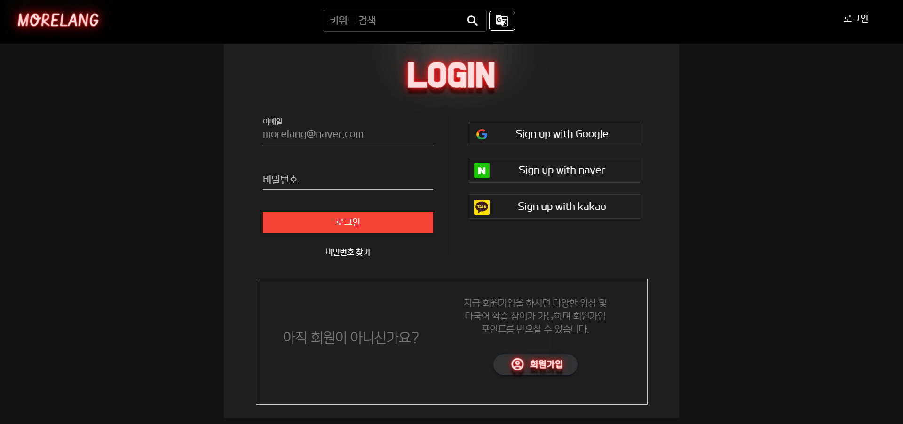

  - *MoreLang 계정 로그인 및 SNS 로그인 제공*
  ```
  - OAuth2 방식을 활용한 Social Login 인증 방식(Google, Kakako, Naver)
  - JWT를 활용한 내부 Token 인증 방식
  - SMTP를 활용한 E-mail 인증을 통한 회원 가입 구현
  - ID/PW 찾기 기능 구현
  - 로그인 시 Welcome point 1000 포인트 지급
  ```

</details>
<details>
<summary>2. 추천 채널 & 영상 ✔</summary>

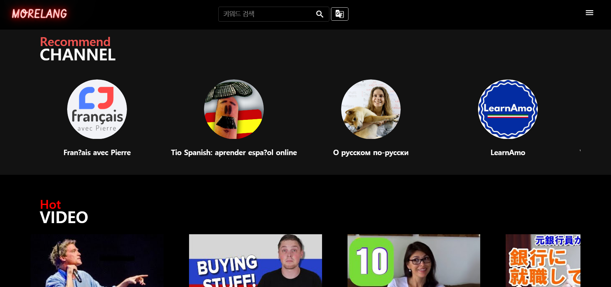


  - *언어별 추천 채널 및 조회수 높은 영상 제공*

  ```
  - 관리자가 밤새 선별한 각 나라 별 "우수하고 정확한" 내용 DB축적
  - 10여개국의 우수 채널 제공
  - Morelang 사용자들이 가장 많이 즐겨본 각 나라별 영상들 "한눈에"" 파악가능
  ```
</details>
<details>
<summary>3. 검색 ✔</summary>

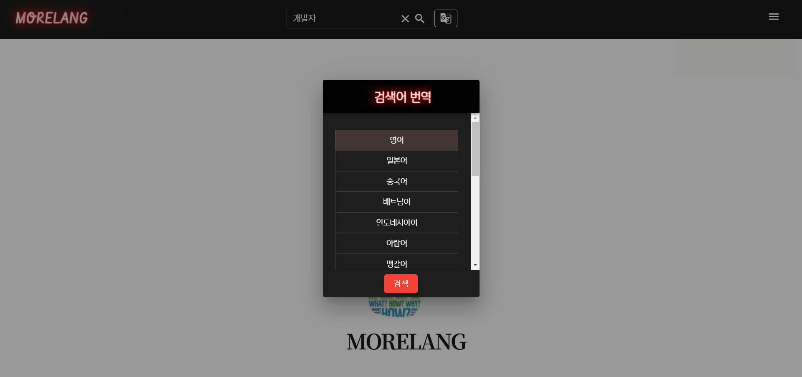


  - *검색어 번역 기능 제공*

  ```
  - 카카오 번역 API를 활용한 번역기능
  - 검색창에 어떤 언어로 입력하더라도 "원하는" 나라의 언어로 번역가능
  ```

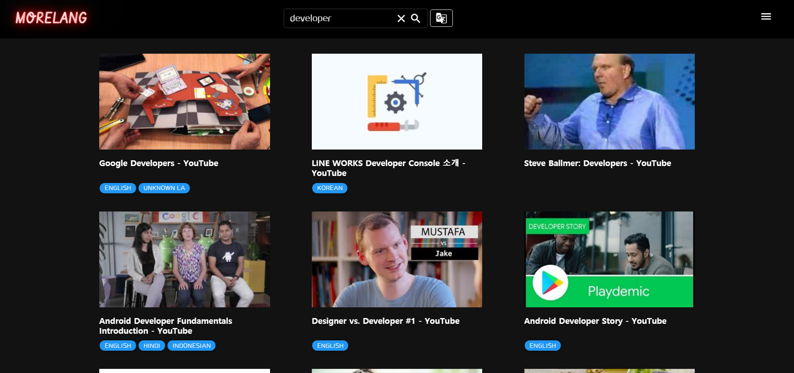


  - *유튜브 영상 검색 기능*

  ```
  - 검색어 번역으로 현지 사람 처럼 따끈따끈한 영상 검색 가능
  - YouTube API를 활용해, YouTube에 존재하는 어떤 영상이든 해당 키워드로 조회가능.
  ```
  </details>
<details>
<summary>4. 채널 ✔</summary>


  - *유튜브 채널 정보 및 비디오 리스트 제공*
  ```
  - YouTube Channel API를 활용해, YouTube에 존재하는 채널을 Morelang만의 디자인으로 조회 가능
  - 해당 Channel에 존재하는 영상을 자유롭게 Morelang으로 학습가능
  ```
</details>
<details>
<summary>5. 결제 ✔</summary>

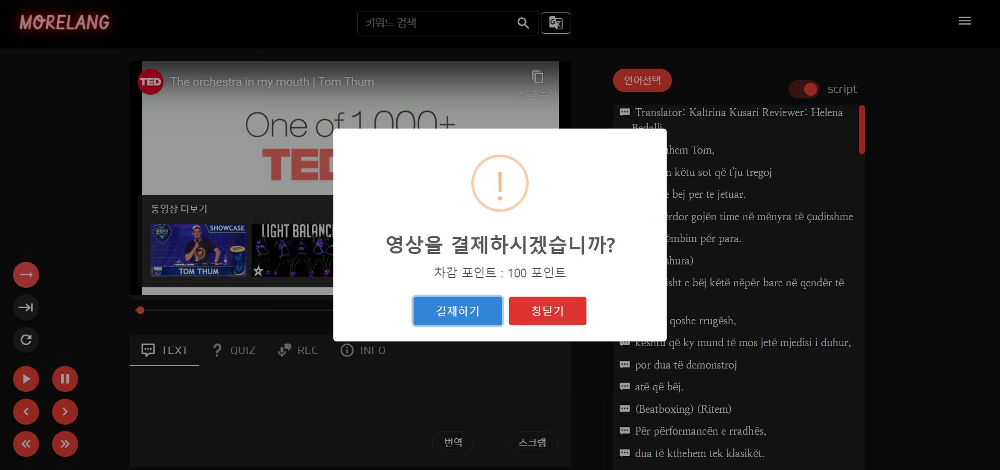


  - *포인트를 사용하여 영상 학습 가능*
  ```
  - MoreLang만의 결제 시스템.
  - 1000원을 결제하 100편의 동영상을 MoreLang에서 즐길 수 있습니다.
  - 해당 영상의 학습기능을 이용하고 싶으면, 100포인트로 결제하면 됩니다.
  ```
</details>     
<details>
<summary>6. 자막선택 ✔</summary>

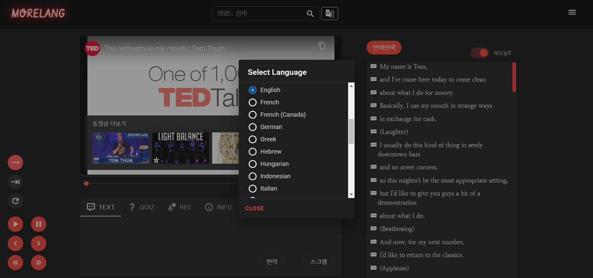


  - *영상에서 제공하는 자막 선택 가능*
  ```
  - YouTube API 활용
  - 해당 영상에서 제공하는 공식 자막들의 종류를 한눈에 확인할 수 있습니다.
  - 학습하고 싶은 언어로 언제든지 자유롭게 변경하면서 확인할 수 있습니다.
  ```
</details>
<details>
<summary>7. 스크립트 ✔</summary>


  - *유튜브 영상의 자막 스크립트를 이용하여 학습 가능*
  ```
  - YouTube API 활용
  - 사용자가 선택한 자막을 활용해, 동영상에서 나오고 있는 알 수 없는 언어들을 스크립트로 한 눈에 보여줍니다.
  ```
</details>
<details>
<summary>8. 문장 번역 ✔</summary>

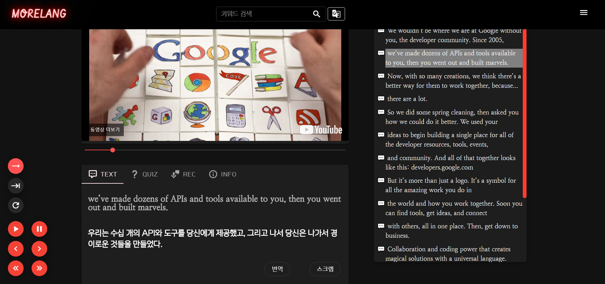


  - *영상의 문장을 한글로 번역하는 기능 제공*
  ```
  - Kakao 번역 API를 활용해, 번역을 누르면
  - 현재 나오고 있는 궁금한 말들을, 바로바로 한국어로 번역한 내용으로 볼수 있습니다.
  ```
</details>
<details>
<summary>9. 문장 스크랩 ✔</summary>


  - *영상의 문장을 스크랩하는 기능 제공*
  ```
  - 이 문장은 기억해야겠다! 라는 생각이 들면
  - 마우스 드래그 후, Button click!을 통해 간편한 메모와 함께 문장을 소장할 수 있습니다.
  ```
</details>
<details>
<summary>10. 문장 퀴즈 ✔</summary>

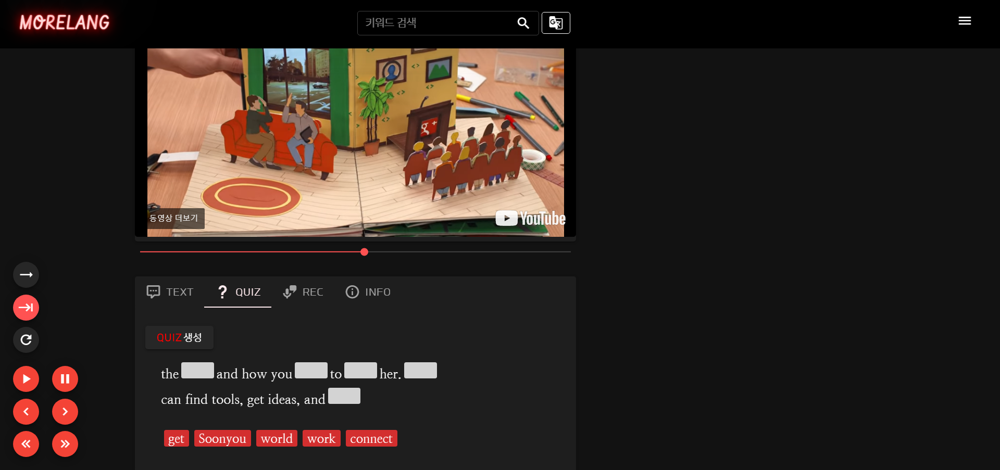


  - *영상의 문장을 이용한 문장 퀴즈 생성*
  ```
  - 구글 Nature Language API를 활용
  - 10여개국의 동영상에서 퀴즈 생성가능
  - 중요한 부분에 필요한 퀴즈를 풀면서, 내 문장으로 습득가능
  ```
</details>
<details>
<summary>11 .녹음 ✔</summary>

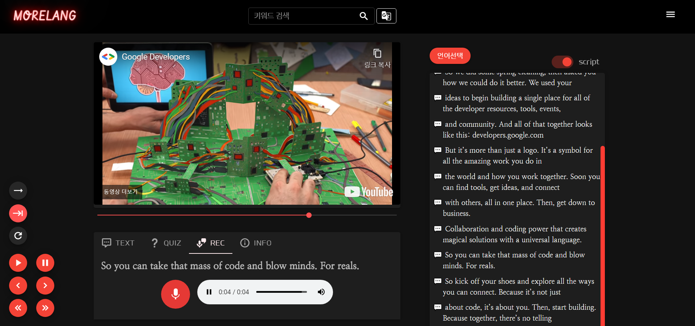


  - *녹음을 통하여 자신의 발음 확인 가능*
  ```
  - 지금 동영상에서 말하고 있는 사람과
  - 내 발음이 얼마나 다른지 녹음하고 직접들음으로써 학습기능 향상
  ```
</details>
<details>
<summary>12. 재생 컨트롤러 ✔</summary>

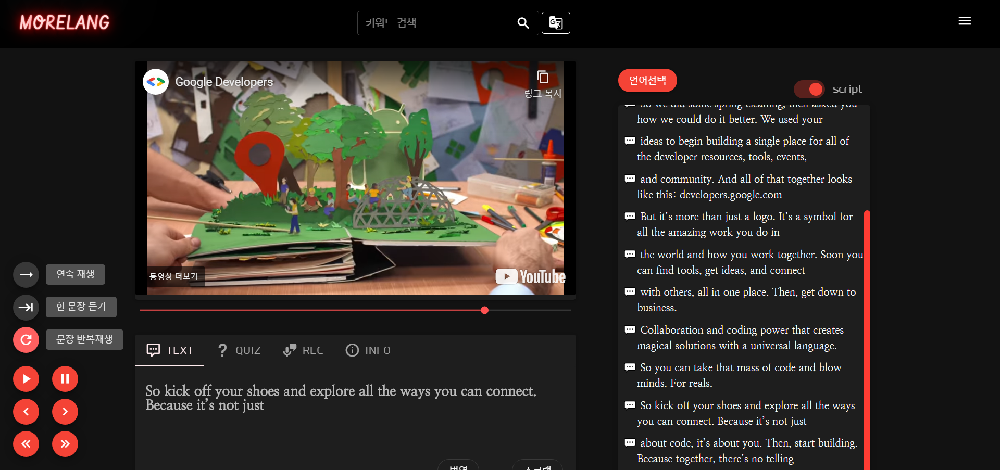


  - *좌측 하단의 컨트롤러를 이용하여 재생 조작 가능*
  ```
  - 학습친화적이고, 직관적인 UI를 통해, 연속재생, 구간재생, 이전 스크립트, 다음 스크립트등
  - 자유롭게 동영상 조작할 수 있는 기능
  ```
</details>     
<details>
<summary>13. 단어 사전검색 & 스크랩 ✔</summary>


  - *단어를 드래그하여 선택하면 부가기능 표시*


- *선택된 단어 사전검색 기능 제공*

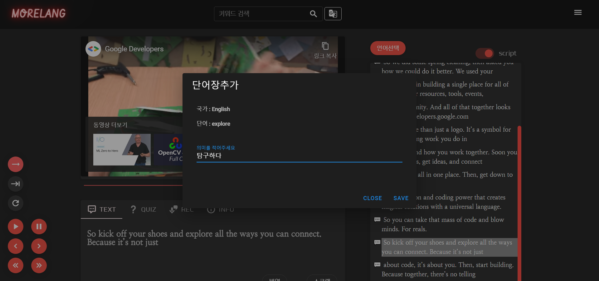

- *단어장추가 기능 제공*
```
- iframe과 다음 단어페이지를 활용하여
- 모르는 단어가 있으면, 드래그하여 선택만으로 해당 단어의 사전을 한눈에 확인가능
- 그리고, 기억하고 싶은 내용이라면? Button Click으로 내 단어장에 추가가능
```
</details>
<details>
<summary>14. My Page ✔</summary>

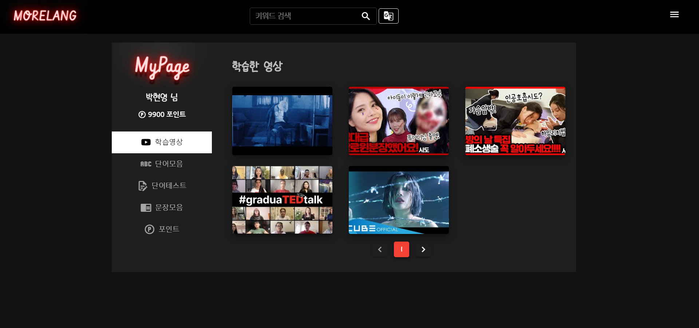

- *Mypage에서 나만을 위한 기능*
```
- 내가 결제했던 동영상을 Mypage에서 한눈에 조회가능
- 내 포인트, 단어모음, 문장모음으로 이동할 수 있습니다.
- 오직 한 사람만을 위한 페이지
```
</details>
<details>
<summary>15. 충전 기능 ✔</summary>

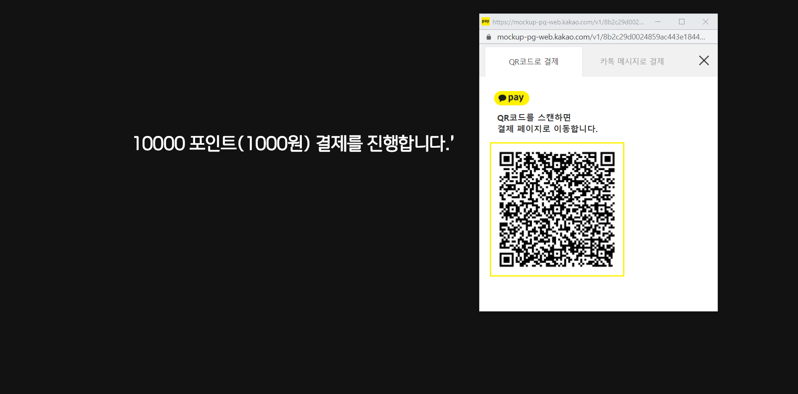


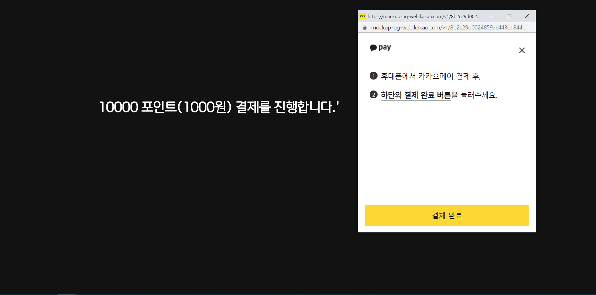

- *Morelang의 포인트를 얻는 방법*
```
- 카카오 결제 API 활용
- 1000원 충전시 10000포인트를 얻는 파격적인 혜택
- 간편한 카카오 페이 결제 방식 채택
```
</details>
<details>
<summary>16. 포인트 내역 조회 기능 ✔</summary>

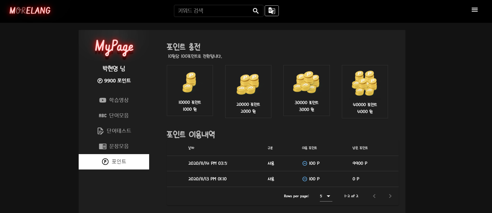

- *포인트 충전 내역 및 기록 조회 가능*
```
- 포인트 충전 내역 및 기록 조회 가능
- 직관적인 색으로 충전, 사용 내역 구분가능
```

</details>
<details>
<summary>17. My 단어장 ✔</summary>

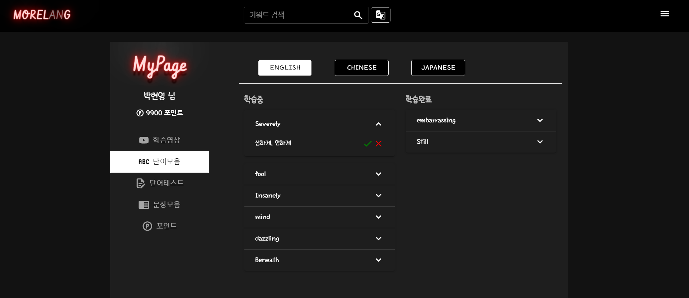

- *나만의 단어장에 기록된 내용들 확인 가능*
```
- 학습하면서 추가했었던 단어들을 언어별로 한눈에 확인가능.
- 학습중, 학습완료를 통해 학습할 단어를 손쉽게 조작 가능
- 삭제 기능 구현 완료
```

</details>
<details>
<summary>18. 스크랩한 문장 모음✔</summary>

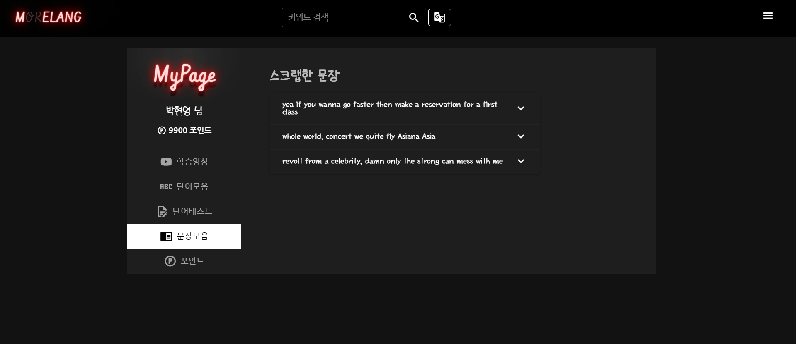
- *학습중 스크랩한 문장 확인 가능*
```
- 학습하면서 기록했었던 문장들을확인가능.
- 문장 클릭시 이전에 기록했던 문장에 대한 Memo 확인 가능
```
</details>


<details>
<summary>19. 단어 퀴즈 ✔</summary>

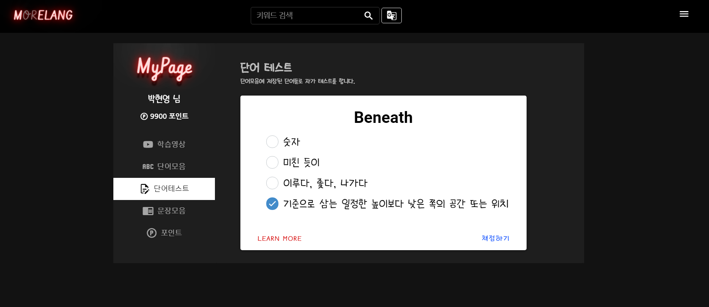

- *단어장에 있는 단어들을 활용한 단어퀴즈*
```
- 단어장에 존재하는 단어들을 활용해 단어 퀴즈를 풉니다.
- 마지막에 맞은 개수를 확인함으로써, 얼마나 성장했는지 수치로 볼 수 있습니다.
```
</details>

---
<!-- ## ⏰ 프로젝트 진행 현황
<details>
<summary>Week 1 :  2020.10.12(월) ~ 2020.10.18(일)</summary>

### 이번주 한일

- 팀빌딩 + 아이스브레이킹
- 프로젝트 주제 선정, 필요 기술스택 선정
- 기획서 작성

### 기타

- <del>1. 음성합성</del>
- <del>2. 스냅샷 찍어주는 사진작가 매칭</del>
- <del>3. 인공지능/ 빅데이터 라벨링 - 소일거리</del>
- <del>4. 액티브 시니어를 위한 가벼운 자서전</del>
- 5.영어 학습 서비스 => 발전시켜서 채택  

### 주제 선택 : 'YouTube' 영상을 활용한 외국어 학습 컨텐츠

### 기술 스택 선택
- Vue + Spring

### 기획서 작성
- [프로젝트 기획서](./resource/file/프로젝트기획서.docx)
</details>
<details>
<summary>Week 2 :  2020.10.19(월) ~ 2020.10.25(일)</summary>

### 이번주 한일

### FrontEnd
- 전체적인 흐름에 따른 페이지 구상 (와이어 프레임)
- 메인 페이지 및 마이페이지 구조 형성 및 디자인
- 채널 페이지 구조 형성 및 디자인
- 메인 페이지 내 애니메이션 효과 적용
- 구글 소셜 로그인 구현

### BackEnd
- 주제 구현을 위해 필요한 데이터를 위한 API 찾기(어렵당😓;)
- Google API, Youtube API 사용법 및 API 조작법 숙지
- 각 API에 따른 DTO 구현 및 DB 설계
- 구글 소셜 로그인 구현
- AWS 서버 구축
- Docker를 활용한 무중단 배포 구현
- NGINX, Jenkins 설정
- 임시 도메인 주소 획득 및 HTTPS를 위한 SSL 설정 -->

### API 찾기
- [API 조회](./resource/file/API정리.md)
- [비디오페이지개발일지](./resource/file/비디오페이지개발일지.md)
</details>

---
## 📁 Project Folder
```
📁MySQL
📁client
├── 📁src
│   ├── 📁App
│   ├── 📁assets
│   ├── 📁components
│   ├── 📁plugins
│   ├── 📁components
│   ├── 📁store(Vuex)
│   ├── 📁Router
│   └── 📁utils
│
📁server
├── 📁src
│   └── 📁main
│	│	├── 📁java
│	│	│	├── 📁Application
│	│	│	├── 📁config
│	│	│	├── 📁controller
│	│	│	├── 📁dto
│	│	│	├── 📁jwt
│	│	│	├── 📁util
│	│	│	├── 📁repository
│	│	│	└── 📁service
│	│	└── 📁resources
│	└── 📁test
│           ├── 📁java
│	    └── 📁resources
└── pom.xml
```

---

## 📺 화면 구성 (와이어 프레임)


### Main function
- 메인 페이지
- 채널 디테일
- 영상 학습

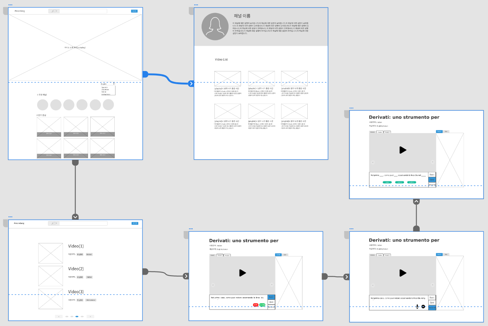

### MyPage
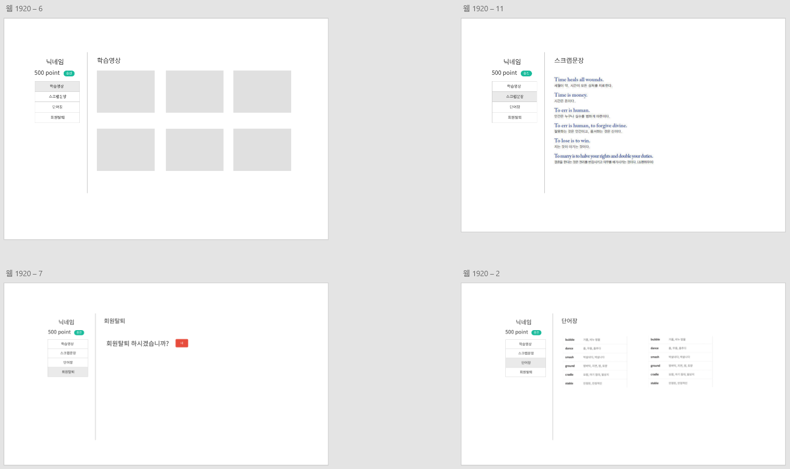

---
## 📚 DataBase 구조도 (ERD)


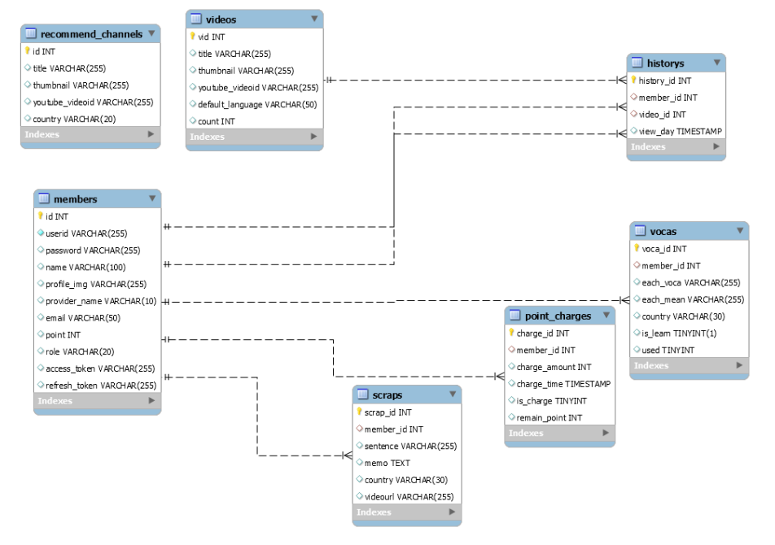


---
## 📃 Api Reference
- [API 정리서](./resource/file/API정리.md)
- [비디오페이지개발일지](./resource/file/비디오페이지개발일지.md)
---
## 🔧 Tech Stack
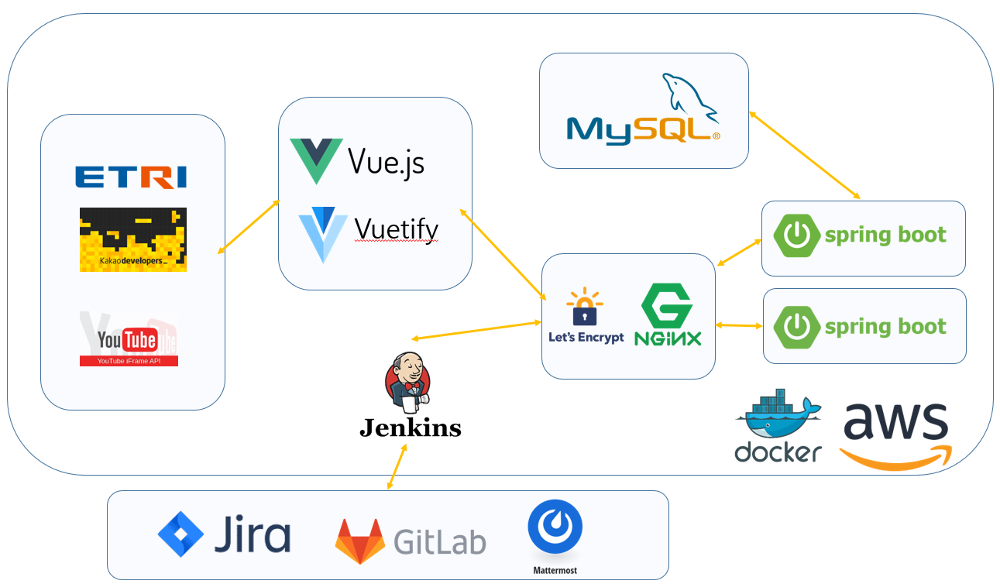

---
## 참고파일

- [프로젝트 기획서](./resource/file/프로젝트기획서.docx)
- [API 정리서](./resource/file/API정리.md)
- [비디오페이지개발일지](./resource/file/비디오페이지개발일지.md)
---
## 👪Member

| 이름 | 역할 |  상세 소개 |
|:----------:|:----------:|:----------:|
| **공필상** | FULL STACK | 팀장 |
| **김지은** | FRONT END | 팀원 |
| **박진용** | BACK END | 팀원 |
| **박현영** | FRONT END | 팀원 |
| **정성오** | BACK END | 팀원 |
